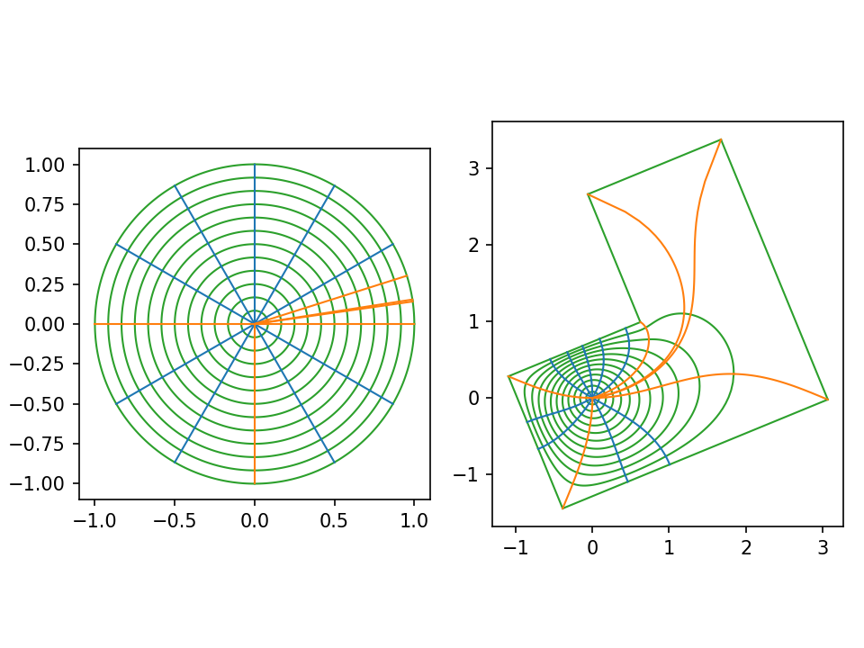

# Schwarz-Christoffel Mappings


This repository includes basic c++ code to calculate Schwarz-Christoffel mappings. It can be run using
```
./integrate <out file> params < input_files/poly1.txt
```
`poly1.txt` describes the Schwarz-Christoffel parameters `A_k` and `beta_k` with space-separated numbers. The first line indices `n`, the number of points in the polygon.

Alternatively, given a set of points it can solve for the parameters with the command
```
./integrate <out file> points < input_files/points.txt
```
The second line describes the real coordinate of each point and the third line describes the imaginary coordinate.

The program outputs a csv file containing the coordinates of the map. An example of how to visualize is in `visualize_sc_mappings.ipynb`.
